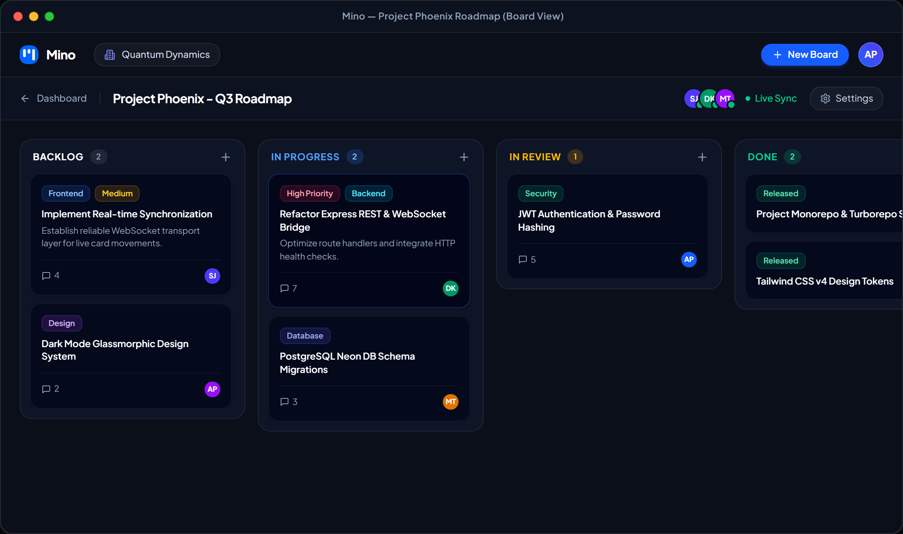
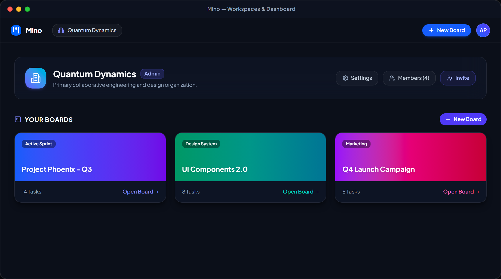
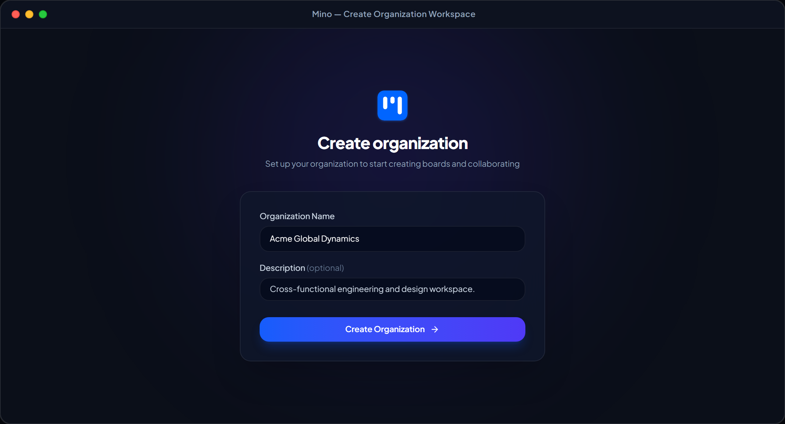
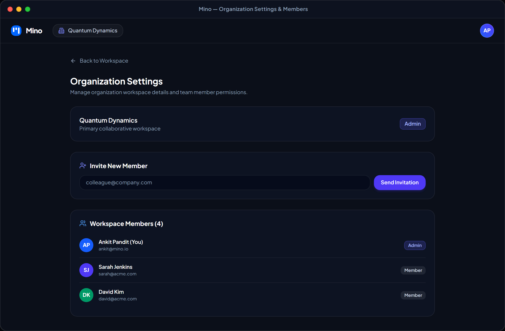
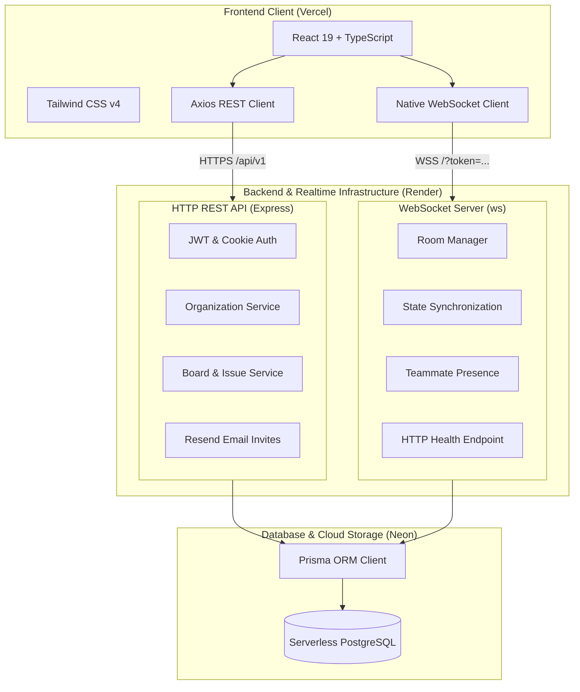

<div align="center">

  

  # Mino
  ### Modern Visual Collaboration Platform for High-Velocity Teams

  <p align="center">
    A real-time, fluid visual Kanban workspace built for teams who value speed, focus, and clarity.
    <br />
    Organize anything. Together, without friction.
  </p>

  <p align="center">
    <a href="https://trymino.vercel.app/"><strong>Explore Live App »</strong></a>
    ·
    <a href="https://trymino.vercel.app/signup">Create an Account</a>
    ·
    <a href="https://trymino.vercel.app/changelog">Changelog</a>
    ·
    <a href="https://x.com/ankitpanditdev">Created by @ankitpanditdev</a>
  </p>
</div>

---

<div align="center">
  
</div>

---

## 📑 Table of Contents

- [Overview](#-overview)
- [Key Features](#-key-features)
- [Visual Showcase](#-visual-showcase)
  - [1. Collaborative Kanban Board](#1-collaborative-kanban-board)
  - [2. Workspaces & Dashboard](#2-workspaces--dashboard)
  - [3. Organization Onboarding](#3-organization-onboarding)
  - [4. Workspace Settings & Member Management](#4-workspace-settings--member-management)
- [System Architecture](#-system-architecture)
- [Monorepo Structure](#-monorepo-structure)
- [Tech Stack](#-tech-stack)
- [Getting Started](#-getting-started)
  - [Prerequisites](#prerequisites)
  - [Installation & Setup](#installation--setup)
  - [Environment Configuration](#environment-configuration)
  - [Database Setup](#database-setup)
  - [Running the Services](#running-the-services)
- [Deployment](#-deployment)
- [API Reference & Protocols](#-api-reference--protocols)
- [Contributing](#-contributing)
- [License](#-license)

---

## 🌟 Overview

**Mino** is a full-stack, collaborative project management workspace inspired by Trello and Linear, engineered with a clean monorepo architecture. 

It replaces bloated project trackers with a lightweight, distraction-free environment where cards move in real-time across custom workflows, team presence is broadcasted live, and discussions happen directly in context.

---

## ⚡ Key Features

| Feature | Description |
| :--- | :--- |
| 🗂️ **Fluid Kanban Boards** | Drag, drop, and reorganize cards across customizable stages (`Backlog`, `In Progress`, `In Review`, `Done`). |
| 🔴 **Live Teammate Presence** | Real-time WebSocket room broadcasting shows active team avatars on the board with glowing online indicators. |
| 🏢 **Multi-Tenant Workspaces** | Organize departments, ventures, or clients into isolated organizations with fast switching. |
| 👥 **Team Invitations & RBAC** | Send secure 1-click email invites powered by **Resend** with role-based access controls (`admin` vs `member`). |
| 💬 **In-Context Discussions** | Comment directly on task cards with rich user timestamps and real-time thread updates. |
| 🎨 **Obsidian Dark Aesthetic** | Tailored dark UI (`#07090e`) with glowing blue ambient lighting, glassmorphism, and responsive layouts. |
| 🚀 **High-Performance Monorepo** | Orchestrated by **Turborepo** and powered by **Bun** for rapid builds and hot-reloading. |

---

## 📸 Visual Showcase

### 1. Collaborative Kanban Board
Full-screen board workspace featuring real-time teammate presence avatars, live sync indicators, modular status columns (`Backlog`, `In Progress`, `In Review`, `Done`), priority tags, and comment counters.

<div align="center">
  
</div>

<br />

### 2. Workspaces & Dashboard
Centralized dashboard for active organizations, highlighting active team rosters, one-click board creation, and gradient-card project overviews.

<div align="center">
  
</div>

<br />

### 3. Organization Onboarding
Sleek, ambient onboarding workflow for provisioning new team organizations and establishing isolated collaborative workspaces.

<div align="center">
  
</div>

<br />

### 4. Workspace Settings & Member Management
Granular organization administration with member invite links, permission management, and role-based access control badges (`Admin` vs `Member`).

<div align="center">
  
</div>

---

## 🏗️ System Architecture

Mino employs a decoupled micro-architecture combining a high-speed REST API with a dedicated real-time WebSocket cluster:



---

## 📦 Monorepo Structure

```bash
mino/
├── apps/
│   ├── frontend/            # React 19 SPA, Tailwind CSS v4, Bun bundler
│   │   ├── src/
│   │   │   ├── components/  # Modals, Navbar, Logo, Cards, Theme components
│   │   │   ├── context/     # AuthContext state providers
│   │   │   ├── hooks/       # useBoardSocket (real-time hook)
│   │   │   ├── lib/         # api.ts (Axios & WS client with auto-prefixing)
│   │   │   ├── pages/       # HomePage, DashboardPage, BoardPage, AuthPage, Changelog
│   │   │   └── frontend.tsx # App entry point
│   │   ├── build.ts         # Fast Bun production build pipeline
│   │   └── package.json
│   │
│   ├── backend/             # Express REST API (Auth, Orgs, Boards, Invites)
│   │   ├── src/
│   │   │   ├── auth.ts      # Sign-up, Sign-in, JWT verification
│   │   │   ├── org.ts       # Workspace CRUD & memberships
│   │   │   ├── board.ts     # Board creation, retrieval & deletion
│   │   │   ├── section.ts   # Kanban column logic
│   │   │   ├── issue.ts     # Task cards, reordering & assignments
│   │   │   ├── comment.ts   # Card discussion threads
│   │   │   └── invite.ts    # Resend email invitations
│   │   ├── index.ts         # Server entry point with dynamic PORT & CORS
│   │   └── package.json
│   │
│   └── websocket/           # Standalone WebSocket server for live updates
│       ├── index.ts         # Room subscriptions, presence broadcast & health check
│       └── package.json
│
├── packages/
│   ├── db/                  # Centralized Prisma schema & PostgreSQL client
│   │   ├── prisma/
│   │   │   └── schema.prisma
│   │   └── index.ts
│   ├── ui/                  # Shared UI components
│   ├── typescript-config/   # Shared TypeScript configurations
│   └── eslint-config/       # Shared ESLint rules
│
├── assets/                  # High-resolution mockups & visual assets
├── turbo.json               # Turborepo task pipeline configuration
└── package.json             # Root monorepo scripts
```

---

## 🛠️ Tech Stack

### Frontend Application
- **Framework**: React 19 with TypeScript
- **Styling**: Tailwind CSS v4 with custom glassmorphic utilities
- **Routing**: React Router v7
- **Icons**: Lucide React
- **HTTP Client**: Axios with automatic auth interceptors
- **Build Tooling**: Bun Native Bundler (`build.ts`)
- **Hosting**: Vercel

### Backend Services
- **Runtime**: Node.js / Bun
- **Framework**: Express.js
- **Authentication**: JWT (JSON Web Tokens) with `cookie-parser`
- **Security**: CORS origin whitelisting & input sanitization
- **Email Delivery**: Resend API
- **Hosting**: Render

### Realtime Layer
- **Protocol**: WebSockets (`ws` library)
- **Architecture**: Room-based pub/sub for boards
- **Features**: Live card position synchronization, presence broadcast, health monitoring endpoint (`200 OK`)
- **Hosting**: Render

### Database & ORM
- **Database**: PostgreSQL (Serverless via Neon)
- **ORM**: Prisma Client with full type safety

---

## 🚀 Getting Started

### Prerequisites

- [Bun](https://bun.sh/) (v1.1+ recommended) or [Node.js](https://nodejs.org/) (v20+)
- A [Neon](https://neon.tech/) or local PostgreSQL database
- A [Resend](https://resend.com/) account for email invites (optional for local testing)

---

### Installation & Setup

1. **Clone the repository:**
   ```bash
   git clone https://github.com/student-ankitpandit/mino.git
   cd mino
   ```

2. **Install all dependencies across the monorepo:**
   ```bash
   bun install
   ```

---

### Environment Configuration

Create `.env` files in each service directory:

#### 1. Database (`packages/db/.env`)
```env
DATABASE_URL="postgresql://<user>:<password>@<host>/<dbname>?sslmode=require"
```

#### 2. Backend (`apps/backend/.env`)
```env
PORT=3001
JWT_SECRET=your_super_secret_jwt_key
DATABASE_URL="postgresql://<user>:<password>@<host>/<dbname>?sslmode=require"
RESEND_API_KEY=re_your_resend_api_key
FRONTEND_URL=http://localhost:3000
```

#### 3. WebSocket (`apps/websocket/.env`)
```env
PORT=3002
WS_PORT=3002
JWT_SECRET=your_super_secret_jwt_key
DATABASE_URL="postgresql://<user>:<password>@<host>/<dbname>?sslmode=require"
```

#### 4. Frontend (`apps/frontend/.env`)
```env
NODE_ENV=development
BACKEND_URL=http://localhost:3001
WS_URL=ws://localhost:3002
```

---

### Database Setup

Generate the Prisma client and sync the schema to your database:

```bash
# From the root directory
cd packages/db
bunx prisma db push
bunx prisma generate
cd ../..
```

---

### Running the Services

You can run all three services concurrently using Turborepo or in separate terminal tabs:

#### Option A: Running with Turborepo (Recommended)
```bash
bun dev
```

#### Option B: Running individually
```bash
# Terminal 1: Backend API (Port 3001)
cd apps/backend
bun start

# Terminal 2: WebSocket Server (Port 3002)
cd apps/websocket
bun start

# Terminal 3: Frontend App (Port 3000)
cd apps/frontend
bun dev
```

Open [http://localhost:3000](http://localhost:3000) in your browser to view Mino.

---

## 🌐 Deployment

### Frontend (Vercel)
1. Import the repository into **Vercel**.
2. Set **Root Directory** to `apps/frontend`.
3. Set **Build Command** to `bun run build.ts`.
4. Set **Output Directory** to `dist`.
5. Add Environment Variables:
   - `BACKEND_URL` = `https://<your-backend>.onrender.com`
   - `WS_URL` = `wss://<your-websocket>.onrender.com`

### Backend (Render)
1. Create a new **Web Service** on **Render** pointing to `apps/backend`.
2. Set **Build Command** to `bun install`.
3. Set **Start Command** to `bun start`.
4. Add Environment Variables (`DATABASE_URL`, `JWT_SECRET`, `RESEND_API_KEY`, `NODE_ENV=production`).

### WebSocket Server (Render)
1. Create a new **Web Service** on **Render** pointing to `apps/websocket`.
2. Set **Build Command** to `bun install`.
3. Set **Start Command** to `bun start`.
4. Add Environment Variables (`DATABASE_URL`, `JWT_SECRET`, `NODE_ENV=production`).

---

## 📡 API Reference & Protocols

### REST Endpoints (`/api/v1`)

| Method | Endpoint | Description | Auth Required |
| :--- | :--- | :--- | :---: |
| `POST` | `/signup` | Register a new user account | No |
| `POST` | `/login` | Authenticate user & receive JWT | No |
| `GET` | `/me` | Get currently authenticated profile | Yes |
| `GET` | `/organizations` | List organizations user belongs to | Yes |
| `POST` | `/organization/create`| Create a new organization workspace | Yes |
| `GET` | `/boards/:orgId` | List all boards in an organization | Yes |
| `POST` | `/board/create` | Create a new board with default columns | Yes |
| `GET` | `/board/:boardId` | Fetch full board state (sections, issues) | Yes |
| `POST` | `/issue/create` | Create a new task card | Yes |
| `PATCH`| `/issue/:issueId/move`| Move an issue between columns | Yes |
| `POST` | `/invite/send` | Send an email invite to a workspace | Yes |

### WebSocket Events (`wss://.../?token=<JWT>`)

```json
// Join a board room
{
  "type": "join",
  "boardId": "board_uuid"
}

// Move card event (broadcasted to all board members)
{
  "type": "move",
  "issueId": "issue_uuid",
  "sectionId": "target_section_uuid"
}

// Teammate Presence (received on connection & room changes)
{
  "type": "initial_state",
  "users": ["user_id_1", "user_id_2"]
}
```

---

## 🤝 Contributing

Contributions are welcome! If you'd like to improve Mino:

1. Fork the Project (`gh repo fork student-ankitpandit/mino`)
2. Create your Feature Branch (`git checkout -b feat/AmazingFeature`)
3. Commit your Changes (`git commit -m 'feat: Add AmazingFeature'`)
4. Push to the Branch (`git push origin feat/AmazingFeature`)
5. Open a Pull Request

---

## 📄 License

Distributed under the **MIT License**. See `LICENSE` for more information.

---

<div align="center">
  Crafted with ❤️ by <a href="https://x.com/ankitpanditdev"><strong>@ankitpanditdev</strong></a>
  <br />
  <sub>If you find Mino helpful, please consider giving it a ⭐ on GitHub!</sub>
</div>
